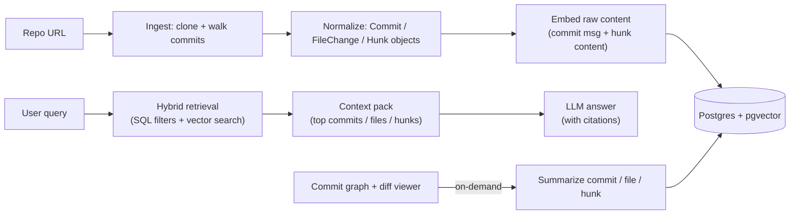

> **Every repo has a story.** We built GitOdyssey to make that story searchable, explorable, and explainable.

[](https://youtu.be/DYcpnQevTuk)

## Why we built GitOdyssey

During onboarding and code review at large companies, understanding why the code looks the way it does can take weeks. You’re not just reading files, you’re reconstructing decisions:

- Why was authentication refactored?
- When did error handling change?
- Which commits touched this module during the incident last quarter?

Modern AI coding assistants help a lot, but they mostly operate on the **current snapshot** of a codebase. During the University of Texas at Austin's annual HackTX hackathon, our team asked a simple question:

> What if your repository’s entire history became an interactive, AI-queryable knowledge graph?

That became **GitOdyssey**: a web app that ingests a Git repo, builds a commit graph, and lets you explore changes visually then ask natural language questions grounded in commit-level evidence.

For the exact tech stack, please refer to the [repo](https://github.com/DylanPina/git-odyssey/tree/main?tab=readme-ov-file).

---

## What is GitOdyssey

- **Interactive commit graph** you can pan/zoom and click through.
- **Monaco diff viewer** (VS Code’s editor) for side-by-side diffs.
- **AI summaries** at multiple levels:
  - commit → file change → hunk (section of a diff)
- **Semantic search + filters** to highlight the most relevant commits.
- **Chat with citations** so answers stay grounded in specific commits.


<div class="image-container"></div>
<p style="font-size: 0.8rem; text-align: center;"><em>Fig-1: Our Interactive Git Graph U/I</em></p>

<div class="image-container"></div>
<p style="font-size: 0.8rem; text-align: center;"><em>Fig-2: The Summarization Tool in Action </em></p>

<div class="image-container"></div>
<p style="font-size: 0.8rem; text-align: center;"><em>Fig-3: Users can chat with a context-aware foundation model. Anything in the repo's history is fair-game!</em></p>

---

## Git’s internals

Git looks like a list of commits, but internally it’s a **directed acyclic graph (DAG)**.

### The core objects:

- **Blob**: raw content of a file (bytes)
- **Tree**: directory structure (pointers to blobs and other trees)
- **Commit**: points to a tree, plus metatdata (author/time/messages) and parent commits

A commit is powerful because it encodes both:

- **Structure**: the parent relationships (history)
- **Change**: the diff between a commit and its parent

### Diffs, patches, and hunks

  GitOdyssey is fundamentally about change, and in Git that means **diffs**:

- A **diff** (loosely) describes how to transform one snapshot into another.
- A **patch** is the textual representation of that diff.
- A **hunk** is a contiguous block of changed lines inside a patch.

  A typical unified diff has hunk headers like:

  ```diff

@@ -10,7 +10,11 @@

```
  
Which reads like: “around line 10, remove 7 lines from the old file and add 11 lines to the new file.” Hunks are the perfect granularity for developer tooling because they are:

  - small enough to summarize accurately
- large enough to capture intent (more than single-line changes)
- easy to jump to inside a diff viewer

GitOdyssey is built around that idea: commits aren’t just hashes; they’re nodes in a graph that tell a story.

From the earliest brainstorm session, we framed the product as:

> bring version control history into the AI development experience by treating the repo as a narrative, not a snapshot.

---

## Architecture - What is achievable in 24 hours and what we hardened afterwards.

GitOdyssey is a full-stack AI web application:

- **Backend:** Python + FastAPI + SQLAlchemy + Postgres/pgvector
- **Frontend:** React + TypeScript + Tailwind + React Flow + Monaco Diff Editor
- **AI layer:** Gemini for summarization/Q&A + OpenAI embeddings for semantic search
- **Infra (post-hackathon):** Terraform + AWS (ECS Fargate, RDS Postgres, S3/CloudFront)

### High-level user/data flow

This is the mental model I used while building:

<div class="image-container " style="width:1200px;">

</div>

### Backend decisions

### Why FastAPI

FastAPI gave us a fast path to clean APIs, dependency injection, and Pydantic model which was necessary for the fast-paced hackathon and long-term maintainability.

### Postgres + pgvector vs. document DB + vector DB

We debated two architectures:
#### Option A: Postgres as the primary store + pgvector for embeddings (what we chose)

  **Why it fit GitOdyssey:** Git data is inherently relational.

  - commit → file_changes → diff_hunks is a classic parent/child model
- branches connect many commits (many-to-many)
- filters like author/path/time/status are naturally SQL

**Pros**

  - **One source of truth** for metadata + embeddings
- **Powerful filtering** before semantic search (reduces candidate set drastically)
- **Transactional consistency** (less “two system drift”)
- **Simple ops**: one DB, one backup story, one permissions model
  
**Cons / risks**
  

- Postgres is not a dedicated vector engine; very large-scale ANN search can require careful tuning

- Vector indexes (e.g., HNSW) have memory tradeoffs and operational considerations

- As dataset size grows, you’ll likely need more deliberate partitioning, caching, and possibly read replicas

Below is a code snippet depicting how we represented Git data in a relational db with Postgres and pgvector:

```python
class SQLCommit(Base):
	"""SQLAlchemy model for commits."""
	__tablename__ = "commits"
	  
	sha: Mapped[str] = mapped_column(String(40), primary_key=True)
	parents: Mapped[List[str]] = mapped_column(JSON)
	author: Mapped[Optional[str]]
	email: Mapped[Optional[str]]
	time: Mapped[int]
	message: Mapped[str] = mapped_column(Text)
	summary: Mapped[Optional[str]] = mapped_column(Text)
	embedding: Mapped[Optional[List[float]]] = mapped_column(
	Vector(1536)
	) # OpenAI embedding size
	
	# Foreign Keys
	repo_url: Mapped[str] = mapped_column(ForeignKey("repos.url"))
	
	# Relationships
	repo: Mapped["SQLRepo"] = relationship(
	"SQLRepo", back_populates="commits", foreign_keys=[repo_url]
	)
	branches: Mapped[List["SQLBranch"]] = relationship(
	"SQLBranch", secondary="commits_branches", back_populates="commits"
	)
	file_changes: Mapped[List["SQLFileChange"]] = relationship(
	"SQLFileChange", back_populates="commit"
	)
```

  
#### Option B: Document DB (Mongo/Firestore/etc.) + a dedicated vector DB (Pinecone/Weaviate/Milvus)

**Pros**

- Vector DBs are purpose-built for ANN (approximate nearest neighbor) search
- Some provide built-in hybrid search (BM25 + vectors) and metadata filtering
- Horizontal scaling story can be easier if you’re fully committed to that ecosystem

**Cons**

- **Two datastores** means:
- duplicated metadata (paths/authors/timestamps) to make filtering fast
- consistency and sync complexity
- debugging becomes “which system is wrong?”
- Query patterns like “give me the full commit, with all file changes and hunks” become more complex without joins
- Cost is often higher early (managed vector DB + managed primary store
  
**Our conclusion**: for a hackathon MVP (and honestly, for v1), Postgres + pgvector is an excellent choice because Git’s structure _wants_ relational modeling, and hybrid retrieval is easier when your filters live next to your vectors.
  
### Hybrid Retrieval with Postgres + pgvector
  
We perform hybrid retrieval by:
  
- apply SQL filters first
- compute cosine distances on vectors across multiple levels (commit/file_change/hunk)
- union the results
- pick the best match per commit using a window function
  
```python
# Similarity thresholds tuned per entity type
SIMILARITY_THRESHOLDS = {
"commit": 0.5,
"file_change": 0.6,
"hunk": 0.6,
}

# Exclude noisy files (lockfiles, images, generated configs)
EXCLUDED_FILE_PATTERNS = [
"package-lock.json",
"yarn.lock",
".env",
"tsconfig.json",
".png",
".jpg",
# ...
]
```

  

And later:

  

```python
# Combine commit/file/hunk matches
final_query = union_all(commits_semantic, fc_semantic, hunk_semantic).subquery()
# Pick best match per commit SHA
ranked_query = select(
	final_query.c.sha,
	final_query.c.similarity,
	func.row_number().over(
		partition_by=final_query.c.sha,
		order_by=final_query.c.similarity,
	).label("rank"),
	).subquery()

```

### Frontend decisions

We optimized for a “developer-native” experience:

- **React Flow + Dagre** for the commit graph
- **Monaco Diff Editor** so diffs feel like VS Code
- **Section-level summaries** so you can understand changes progressively:
  - file summary first
  - then dive into specific hunks

---

## Retrieval-Augmented Generation (RAG) and Hybrid Search

RAG is the pattern that makes “chat with your repo” actually feasible:

1. Retrieve the best evidence from your repository history
2. Feed that evidence into an LLM
3. Generate an answer that stays grounded in the retrieved context

### Vector search for dummies

We embed text into vectors, then compare similarity using cosine distance:

A typical similarity measure is cosine similarity:

$$
\cos(\theta)=\frac{a \cdot b}{\lvert a \rvert , \lvert b \rvert }
$$

An embedding model converts text/code into a vector (in our case, **1536-dimensional** vectors). Similar meanings map to nearby points.

Intuition: the dot product measures alignment; dividing by lengths normalizes it

Brute force is expensive: comparing one query vector against N stored vectors is \(O(N \cdot d)\) (where d=1536)

At scale, vector DBs (and pgvector via indexes) use **approximate nearest neighbor (ANN)** algorithms:

- Instead of searching every point, they build an index structure that can quickly navigate “regions” of the vector space.
- A popular approach is **HNSW** (Hierarchical Navigable Small World graphs).
  

We can trade a tiny amount of recall for huge speed improvements—and because we combine SQL filters + vectors + multi-level embeddings, quality stays high.

### Why hybrid retrieval beats pure vector search in this case

Pure vector search struggles with exact constraints:

- “Only commits by Alice”
- “Only changes in `src/auth/`”
- “Only between March 1 and March 10”

So our retrieval pipeline is intentionally **two-stage**:

1. **SQL filtering stage** to narrow the candidate set
2. **Semantic ranking stage** to surface the best matches

We combine semantic matches across commits, file-changes, and hunks, then pick the best match per commit using window functions.

```python
# Hybrid search: filter with SQL first, then semantic search
filtered_query = base_query.subquery()

# Combine commit/file/hunk matches
final_query = union_all(commits_semantic, fc_semantic, hunk_semantic).subquery()

# Pick best match per commit SHA
ranked_query = select(
    final_query.c.sha,
    final_query.c.similarity,
    func.row_number().over(
        partition_by=final_query.c.sha,
        order_by=final_query.c.similarity,
    ).label("rank"),
).subquery()
```

---

## Summarization strategy

We built summaries at multiple levels:

- **Hunk summary:** What changed in this diff section, and why?
- **File-change summary:** Roll up the hunks into a file-level narrative
- **Commit summary:** Roll up file summaries into a commit-level story

But summarizing _everything_ up front is expensive and slow, particularly for large repos.

### Lazy summarization

Our strategy is:

1. **Ingest and embed raw content first** (fast ingestion)
2. **Generate summaries on-demand** when users click “Summarize” for a Git object
3. **Immediately embed those summaries** and write them back to the DB

Summary embeddings are higher-signal than raw diffs, so semantic search improves over time.

```python
# Embed summaries and update embeddings
valid_updates = [u for u in updates if u["summary"] is not None]
embeddings = self.embedder.get_batch_embeddings([u["summary"] for u in valid_updates])

for update in updates:
    db_object = self.session.get(update["type"], update["id"])
    db_object.summary = update["summary"]
    if update["id"] in valid_embedding_map:
        db_object.embedding = valid_embedding_map[update["id"]]
    self.session.commit()
```

---

## The diff view

The diff view allows users to learn more in-depth and relevant information about a specific commit:


<div class="image-container"></div>
<p style="font-size: 0.8rem; text-align: center;"><em>Fig-4: The Monaco Diff Viewer should be familiar for those that VS Code</em></p>


We render:

- a file-level panel with a Monaco side-by-side diff
- a list of hunks underneath

For each hunk, we can either:

1. **Jump-to-context**: click the hunk label and the editor scrolls to that range
2. **Summarize this hunk**: generate a focused explanation for just that chunk 

Summarizing only hunks, ensures foundation model resources are used intelligently and gives the user fine-grained control over information flow.

---

## Technical hurdles we hit (and how we handled them)

The hackathon version worked well, but we hit real engineering constraints quickly.

  

### 1) Summarization cost + latency

  

**Problem:** summarizing every commit/file/hunk up front didn’t scale.

  

**Fix:** lazy summarization + batched embedding:

  

- fast initial ingest

- summaries generated only when requested

- summary embeddings persisted for better future retrieval

  

### 2) Relevance: semantic-only wasn’t enough

  

**Problem:** semantic search alone can’t express hard constraints.

  

**Fix:** hybrid retrieval:

  

- SQL filters narrow down candidates

- semantic ranking surfaces the best matches

- exclude noisy files (lockfiles/images/configs) from semantic search

  

### 3) The data problem

  

**Problem:** Git history volume explodes quickly:

  

- file snapshots can be large

- diffs can be noisy

- 1536-dim vectors add real storage costs

  

**Fixes:**

  

- store snapshots strategically (current + previous)

- cache key pieces on the frontend for responsiveness


  

### 4) ORM performance traps (N+1 queries)

  

**Problem:** fetching a commit graph naïvely can explode into N+1 queries.

  

**Fix:** eager loading (`joinedload`) for commit → file_changes → hunks.

```python 

def get_commit(self, sha: str) -> Optional[Commit]:
	query = (
		select(SQLCommit)
		.where(SQLCommit.sha == sha)
		.options(
			joinedload(SQLCommit.file_changes).options(
				joinedload(SQLFileChange.hunks)
			)
		)
	)
	result = self.session.execute(query).scalars().first()
	if result:
		return self.db_adapter.parse_sql_commit(result)
	return None
```


### 5) Hosting constraints during the hackathon (and why we moved)

  

**Problem:** we initially used Render + Supabase and ran into practical limits (rate limiting, memory constraints, latency).

  

**Fix:** post-hackathon we migrated to AWS using Terraform:

  

- ECS Fargate for backend

- RDS Postgres for database

- S3 + CloudFront for frontend

  

### 6) Connection lifecycle issues under time pressure

  

**Problem:** it’s easy to accidentally create multiple engines/sessions quickly and exhaust pools.

  

**Fix:** centralize DB lifecycle and use FastAPI dependency injection to reuse sessions.

---

## Hackathon toolkit

This was my first hackathon, and I learned a lot.

- **"Wow" factor matters**. Your project might be incredibly practical in real life, but the nature of hackathon venues typically favors impressive-_looking_ projects. Utility and functionality certainly matter, but highly visual proejects (e.g., AR/VR, vision models, video games) have a step-up.
- **Show-up prepared and ready to start coding.** Don't waste time deliberating over architectural decisions at the start of the hackathon. Arrive with a team that has clearly divided roles and a strong idea of how you will implement your project. Split work naturally (backend, frontend, infra, db, etc.).
- **Treat the demo like a feature.** A smooth demo is often the highest-leverage deliverable.
- **Network and have fun.** The time-constraint makes this difficult, but hackathons attract a wide array of intelligent and driven engineers. Make some connections and learn from them.

---

## What’s next

A few directions I’m excited about:

- **Incremental ingestion**: only process new commits since last sync
- **Webhooks**: real-time updates via GitHub events
- **Multi-repo search**: organization-wide historical context
- **PR/release summarization**: move beyond commits into product-level narratives
- **Local-first mode**: privacy-preserving ingestion and embeddings

---

If this project or any of my other blogs interest you, please reach out to me via [LinkedIn](www.linkedin.com/in/william-g-sullivan).


